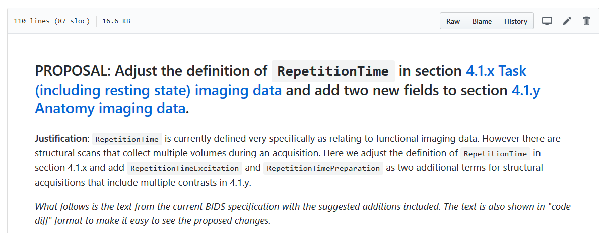
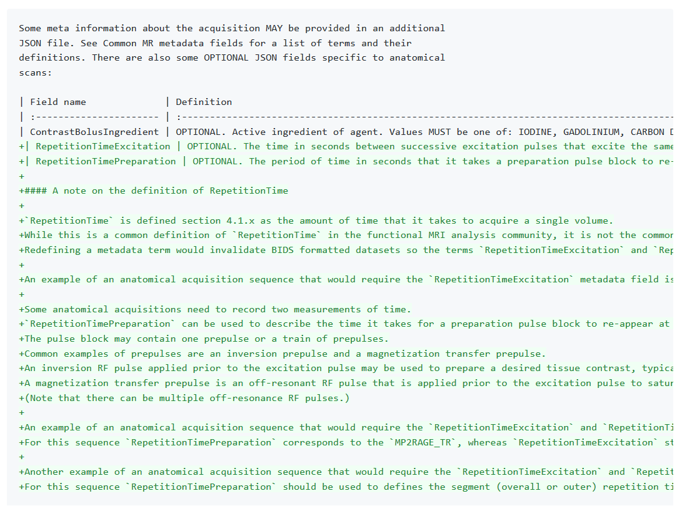
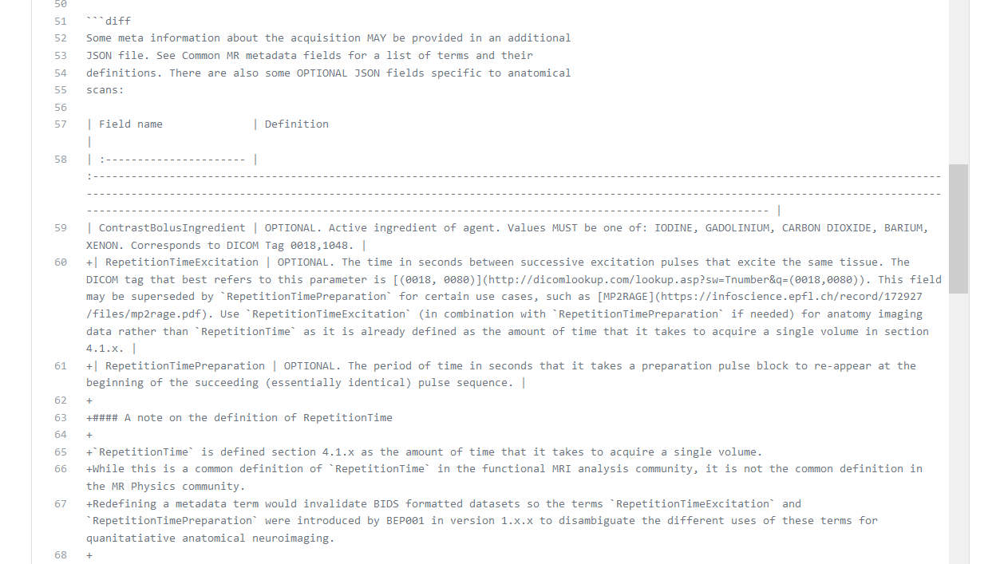

# BEP001

This repository is primarily used for the issues, as a way to project manage ***[BIDS Extension Proposal 001](https://docs.google.com/document/d/1QwfHyBzOyFWOLO4u_kkojLpUhW0-4_M7Ubafu9Gf4Gg/edit#heading=h.6e5avk8akeqj): Structural acquisitions that include multiple contrasts***.

## Our goal

The first version of BIDS was created with the most common use cases from neuroscience and cognitive psychology in mind.
This is entirely in keeping with the [Pareto_principle](https://en.wikipedia.org/wiki/Pareto_principle): that 80% of the use cases come from 20% of the many types of brain imaging acquisitions.

However, there's a huge field of MRI physicists who work on quantiative anatomical imaging for whom 80% of the use cases fall outside of those covered by the current BIDS specification.

Our goal is to extend the [BIDS specification](https://bids-specification.readthedocs.io/en/stable/) to accomodate (at least some of) the most common quantitative MRI acquisitions so they can be shared in BIDS compliant folders.

## Who is building BEP 001

The two leads of BEP 001 are Gilles de Hollander ([@Gilles86](https://github.com/Gilles86)) and Kirstie Whitaker ([@KirstieJane](https://github.com/KirstieJane)).
You can contact them by tagging them in an issue on GitHub or by sending them an email (the addresses are on their GitHub profiles, linked above.

They don't work alone, we have a fantastic community who contribute to this project.
THANK YOU to everyone who has helped shape BEP001.

We don't have a process for acknowledging our community, if you have any ideas or **want to help to record key contributors** please add your thoughts to issue [#1](https://github.com/bids-standard/bep001/issues/1) :sparkles::space_invader::cake:

## How to help

[Our goal](#our-goal) is to extend BIDS to be able to accomodate qMRI datasets.

What that means in practise is that we have to **propose changes to the BIDS specification**.

The BIDS specification is *rendered* as a webpage at https://bids-specification.readthedocs.io.

The website is built from a GitHub repository that consists of mostly markdown files at https://github.com/bids-standard/bids-specification.
If you don't know much about markdown, here's a [good intro guide](https://guides.github.com/features/mastering-markdown/).

The specific file that we are most likely to propose changes to is [src/04-modality-specific-files/01-magnetic-resonance-imaging-data.md](https://github.com/bids-standard/bids-specification/blob/master/src/04-modality-specific-files/01-magnetic-resonance-imaging-data.md), although there may be additional changes that have to happen in other parts of the repository.

### Avoiding great big pull requests

We could do all our work in a branch of the main [bids-specification](https://github.com/bids-standard/bids-specification) repository.
We would be able to see how our proposed changes affected the current version of the specification by opening a [pull request](https://help.github.com/articles/about-pull-requests/).

However, there are quite a few changes to make, and quite a lot of conversation to have around each of them, so our proposed way of working is to **break up the individual changes into manageable chunks**.

Each conceptual update to the specification should have a "proposal file".
This file should explain what change it is proposing and provide a justification for the change.

The developer should also change the file in the BIDS specification (saved in `src` in the master branch of the BEP001 repository) to refect the proposed changes.

Once the proposal is ready, the developer should **open a pull request** to the master branch of the BEP001 repository (this one).
If everyone agrees on the proposal, the file will be merged to master.

Our goal is to build up the accepted individual proposal files in the master branch so that each conceptual update can be easily reviewed by the community.

(There will then be some wrangling to make the one big pull request to the bids-specification.
We'll cross that bridge when we come to it! :sparkles:)

### An example: RepetitionTime

For example: Kirstie is currently working on a proposal to *"Adjust the definition of RepetitionTime in section 4.1.x Task (including resting state) imaging data and add two new fields to section 4.1.y Anatomy imaging data."*.
You can see her suggestion at: https://github.com/KirstieJane/bep001/blob/repetitiontime/Proposal_RepetitionTime.md

#### Proposal top line (title) and introduction

Start with a one sentence explanation of what you're proposing and a justification for why it needs to change.

#### Add the proposed text

Start by linking to the section of the file you want to change, and the current line number of that section

#### Repeat the text but in "diff" format

This is to make it very explicit what has change and what has not.

This is a bit of a pain to do, but will make reviews by the community *much* easier in the long run.

The following screenshot shows what you can see when you're editing the markdown file.

#### If there's a different section that needs to change, repeat the previous two steps

Link to the section of the file you want to change.
Add the proposed text.
Repeat the text making clear what has changed using the "diff" formatting.

### Current proposals under development

:construction: **THIS SECTION IS NOT UP TO DATE! HELP! :construction:

This github repo contains multiple branches that are used to work on different aspects of the project:
 * [master](https://github.com/INCF/BEP001/tree/master) This repo contains only content that has been "signed off on" by the community.
 * [repetitiontime](https://github.com/INCF/BEP001/tree/repetitiontime) This repo contains text we want to change in the main BIDS standard about the definition of _RepetitionTime_.
 * [examples](https://github.com/INCF/BEP001/tree/examples) This repo contains some fake datasets that illustrate BEP001 in practice.

## Finding information and getting in touch

### Google doc

The BEP001 proposal started life as a [google doc](https://docs.google.com/document/d/1QwfHyBzOyFWOLO4u_kkojLpUhW0-4_M7Ubafu9Gf4Gg/edit#heading=h.6e5avk8akeqj) and you may still find it useful to read it and see where the ideas have come from.

We aren't using that document anymore though, so if you have any suggestions or comments, please open an issue at this repository.

### Issues list

We're using the issues at this repository to project manage the different parts of the work we have to do.

Please open an issue if you have a question or a suggestion.
Take a look through the open issues to see if there are any discussions or tasks that you can help to resolve.

### Mailing list

It's also worth joining the [BIDS mailing list](https://groups.google.com/forum/#!forum/bids-discussion).
If you search the list for [[BEP001]](https://groups.google.com/forum/#!searchin/bids-discussion/%5BBEP001%5D%7Csort:date) you should end up with a nice filtered list of relevant emails.

If you're starting a thread on the BIDS mailing list that is relevant to BEP001 please start the subject line with **[BEP001]** so it is easy to identify for people monitoring the forum and so it shows up in the filtered list above.

When you have a point that you'd like to discuss related to BEP001 please try to **start a new thread** so that we can keep discussions reasonably on track.

### Monthly meetings

We try to have zoom meetings once per month.
Keep an eye on the mailing list or this repository's issue tracker for announcements :smiley_cat:

## Licence

The work contained in this repository is licensed under a [Creative Commons Attribution-ShareAlike 4.0 International License](LICENSE).

Please acknowledge the **BIDS Extension Proposal 001 community** when reusing content.
